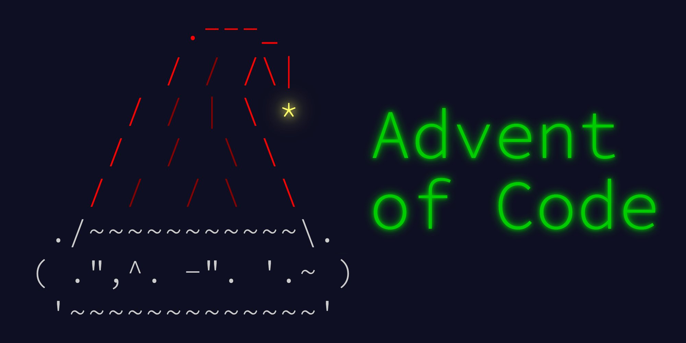

<div id="top"></div>

[![Forks][forks-shield]][forks-url]
[![Stargazers][stars-shield]][stars-url]
[![MIT License][license-shield]][license-url]

<div align="center">
  <a href="https://github.com/ErikBavenstrand/Advent-of-Code">
    
  </a>
</div>

# Advent of Code

[Progress Tracker](https://github.com/ErikBavenstrand/Advent-of-Code/PROGRESS.md)

## Running

First generate the boilerplate code:

```
$ python aoc.py [year] [day] generate --author "Firstname Lastname"
```

Implement the solutions for part A and B and add the test case to `./[year]/[day]/testcase.txt` (needs to be manually copeid from AoC website).

To test the solutions run:

```
$ python aoc.py [year] [day] test
```

Finally, run the following command to solve and submit using the real data.

**Important**: follow the instructions [here](https://github.com/wimglenn/advent-of-code-data#quickstart) on how to add your AoC session cookie to your local machine.

```
$ python aoc.py [year] [day] solve --submit
```

## License

Distributed under the MIT License. See `LICENSE.txt` for more information.

[forks-shield]: https://img.shields.io/github/forks/ErikBavenstrand/Advent-of-Code.svg?style=for-the-badge
[forks-url]: https://github.com/ErikBavenstrand/Advent-of-Code/network/members
[stars-shield]: https://img.shields.io/github/stars/ErikBavenstrand/Advent-of-Code.svg?style=for-the-badge
[stars-url]: https://github.com/ErikBavenstrand/Advent-of-Code/stargazers
[license-shield]: https://img.shields.io/github/license/ErikBavenstrand/Advent-of-Code.svg?style=for-the-badge
[license-url]: https://github.com/ErikBavenstrand/Advent-of-Code/blob/master/LICENSE.txt
